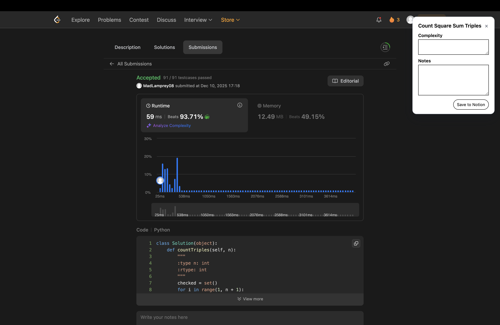

# Not-LC: Notion-LeetCode Tracker 
*A lightweight browser extension for automated capture and structured logging of LeetCode submissions into Notion.*

---

## 1. Overview

Maintaining a consistent record of problem-solving approaches, insights, and mistakes is essential for effective practice. However, this documentation step is easy to forget, and when remembered at a later stage, the details of the approach are often forgotten.

**Not-LC** automates this workflow.

The extension detects successful LeetCode submissions, prompts the user for a quick note, and automatically creates a structured entry in a connected Notion database. This ensures every solved problem is accompanied by metadata and personalized insights, forming a durable knowledge base for long-term learning.

---

## 2. Key Features

### Automated Submission Detection  
Monitors DOM mutations on LeetCode and identifies “Accepted” submissions in real time.

### Inline Note Capture  
Displays a compact, animated notes widget in the top-right corner immediately after an Accepted submission.

### Notion API Integration  
Once the user submits their notes, the extension creates a new page in a selected Notion database using the Notion API.

### Structured Metadata Logging  
Each entry includes:
- Problem title  
- Problem URL  
- Submission timestamp  
- Runtime metrics  
- Memory metrics  
- User-provided notes  
- Auto-incremented count

### Fully Client-Side  
All processing occurs within the browser. The only external request is directly to Notion’s API.

---

## 3. Screenshots
### Notes Widget 


### Notion Entry


---

## 4. Installation
### Step 1 — Clone the Repository

```sh
git clone https://github.com/MadLamprey/Not-LC.git
cd Not-LC
```
### Step 2 — Configure Notion
1. Create a Notion database.
2. Add the following properties:
   - Problem (Title)
   - S.No. (Number)
   - URL (URL)
   - Timestamp (Date)
   - Runtime (Text)
   - Memory (Text)
   - Notes (Text)
   - Complexity (Text)
3. Create a Notion internal integration.
4. Share the database with the integration.
5. Copy the Notion API key and Database ID.

### Step 3 — Configure Notion Credentials
1. In a `.env` file, add your Notion API key and Database ID:
```
NOTION_TOKEN = "secret_xxx";
NOTION_DATABASE_ID = "xxxxxxxxxxxxxxxxxxxxxxxxxxxxxxxx";
```
2. Run the build script to generate the `background.js` file:
```sh
npm run build
```

### Step 4 — Load the Extension
1. Open Chrome (or any Chromium-based browser) and navigate to `chrome://extensions/`.
2. Enable "Developer Mode"
3. Click "Load Unpacked" and select the `Not-LC` directory.

## 5. Usage
1. Navigate to [LeetCode](https://leetcode.com/) and solve a problem.
2. Upon an "Accepted" submission, a notes widget automatically appears.
3. Enter your notes and complexity analysis, then click "Save to Notion".
4. A structured entry is created in your Notion database.


